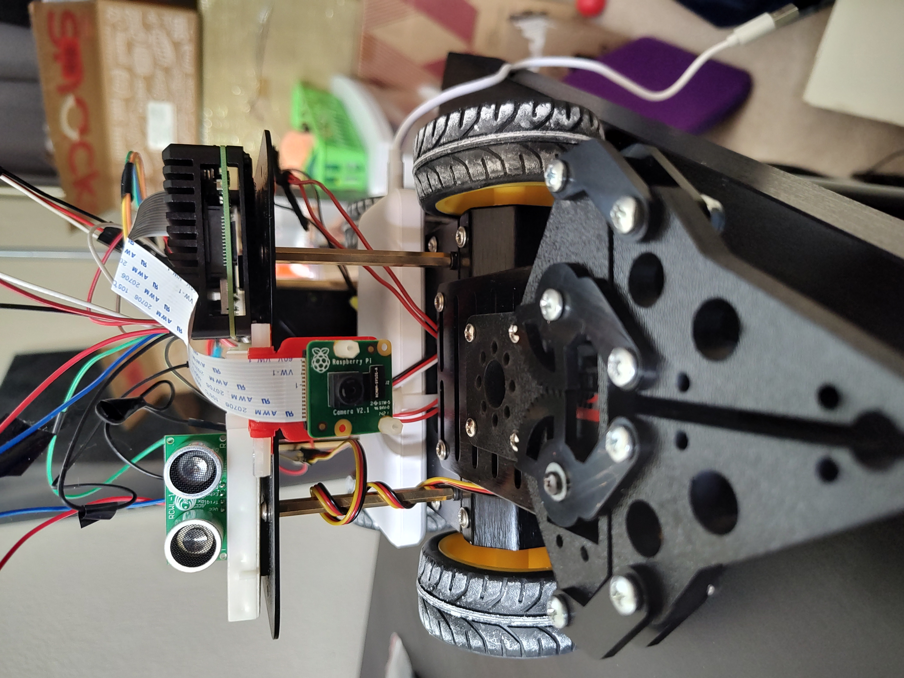
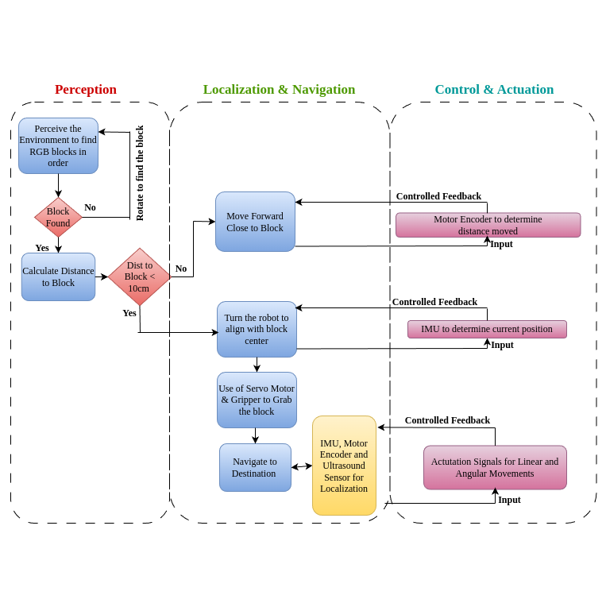

# INTRODUCTION

The course ENPM809T-Autonomous Robotics at University of Maryland, College park provides a hands-on opportunity to build a robot and explore various core concepts in robotics, such as Perception, Planning, Controls, and Modeling. By applying these concepts to a real robot, our ultimate goal is to achieve autonomy. Throughout the course, we have focused on key areas including Perception, Sensor Integration and Calibration, Control, Localization, and Planning. These areas play a crucial role in developing the capabilities of our autonomous robot. A key objective of this course is to engage in an exciting final challenge centered around the construction zone. In this challenge, our robot is entrusted with the autonomous task of picking up objects and placing them accurately between a designated start and goal point.This simulates the practical application of the robot in a real construction zone, reducing the physical work required by human labor.

   
  <em>Figure: Autonomous Mobile Robot</em>

## Integration Details:
The key hardware components of the robot are: 
1. Rasberry Pi and Pi Camera
2. Ultrasonic Sensor
3. Magnetic Encoders
4. H-Bridge
5. IMU and Arduino Nano
6. Gripper
7. DC Geared Motors and wheels
8. A chassis (Pirate) to hold the whole robot assebly

The autonomous mobile robot operates independently, performing tasks by integrating fundamental robotics principles such as perception, localization, control, and navigation. The following process flow diagram offers an overview of how the robot accomplishes pick-and-place tasks through the integration of both software and hardware components:

   
  <em>Figure: Process Flow</em>

### Code : 
The code used for running the robot in final challenge arena is "autnomous_robot.py"

# Course Journey Video:

Below is the youtube link showing the course journey of building the autonomous robot from scratch with demonstration of different approaches and challenges faced.

https://youtu.be/-1Ja9Sxqja4
