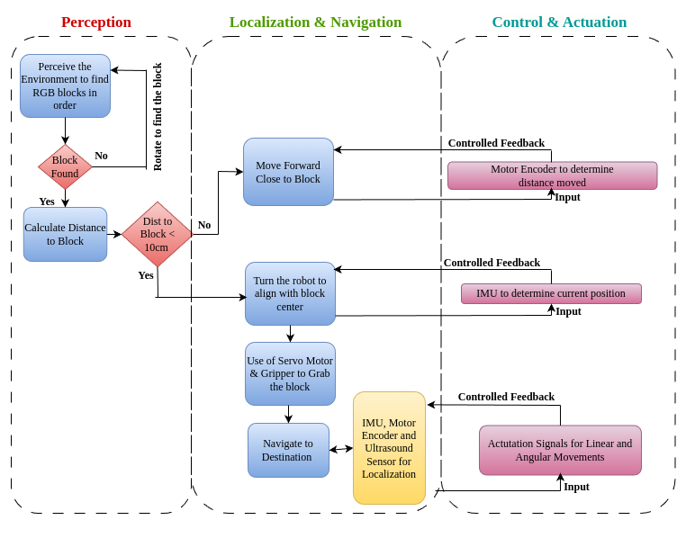

# ENPM809T - Autonomous Robotics

## Introduction

The **ENPM809T-Autonomous Robotics** course at the University of Maryland, College Park offers an enriching, hands-on experience in building a robot while exploring essential concepts in robotics, including **Perception**, **Planning**, **Controls**, and **Modeling**. Our ultimate goal is to achieve autonomy by applying these principles to a real robot.

Throughout the course, we have focused on critical areas such as **Perception**, **Sensor Integration and Calibration**, **Control**, **Localization**, and **Planning**. Each of these components plays a vital role in enhancing the capabilities of our autonomous robot. A significant highlight of this course is an exciting final challenge centered around a construction zone scenario, where our robot autonomously picks up objects and accurately places them between a designated start and goal point, simulating real-world applications in construction.

   
  <em>Figure: Autonomous Mobile Robot</em>

## Integration Details

The key hardware components of the robot include:

1. **Raspberry Pi** and **Pi Camera**
2. **Ultrasonic Sensor**
3. **Magnetic Encoders**
4. **H-Bridge**
5. **IMU** and **Arduino Nano**
6. **Gripper**
7. **DC Geared Motors** and wheels
8. **Chassis (Pirate)** to hold the entire robot assembly

The autonomous mobile robot operates independently, executing tasks by integrating fundamental robotics principles. In the final competition, the robot successfully picked up 8 out of 9 RGB blocks. The following process flow diagram illustrates how the robot accomplishes pick-and-place tasks through the seamless integration of both software and hardware components:

  

### Code

The code utilized to operate the robot in the final challenge arena is located in **code/autonomous_robot.py**.

## Course Journey Video

Check out the YouTube link showcasing the course journey of building the autonomous robot from scratch, including demonstrations of various approaches and the challenges encountered along the way:

[Watch the Course Journey Video](https://youtu.be/-1Ja9Sxqja4)

